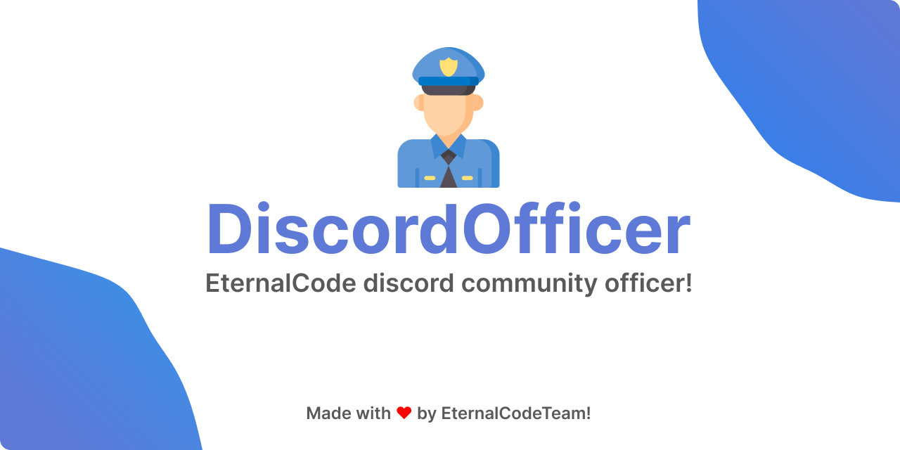

## Installation/Usage

Using Docker:

First run (for generate configuration files)

```bash
$(pwd) - returns your current directory for example /home/user/
```

```bash
docker run -v $(pwd)/discordofficer:/home/eternalcode eternalcode/discordofficer:latest
```


After you configure the bot, run it with the following command:

```bash
docker run -d --name discordofficer -v $(pwd)/discordofficer:/home/eternalcode eternalcode/discordofficer:latest
```

For stop bot use:

```bash
docker stop discordofficer
```

Docker images tags:
* latest - latest stable version using Java 21

Using Java:

Download latest release from releases (.jar file)

Run bot with the following command:

```bash
java -jar DiscordOfficer.jar
```

And u can use screen for run bot in background or something like that
